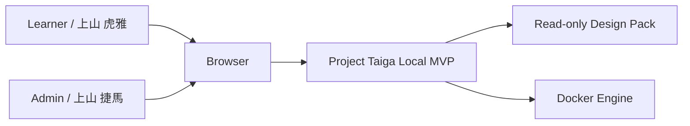
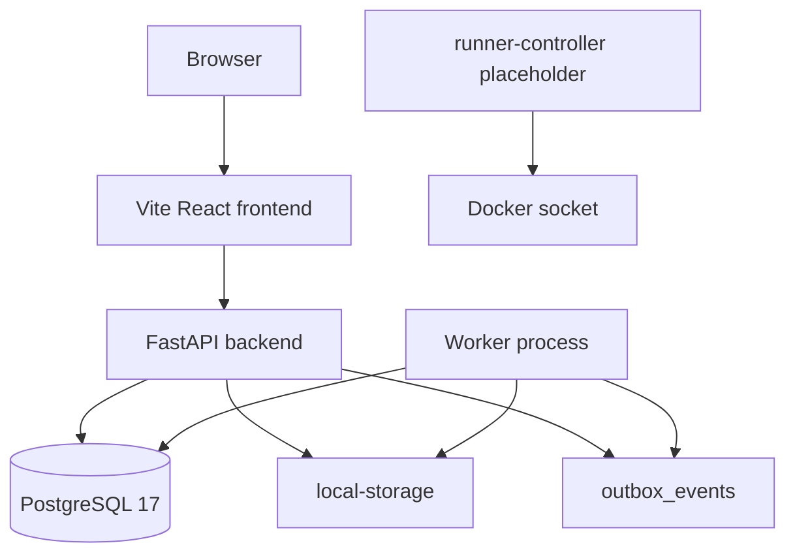
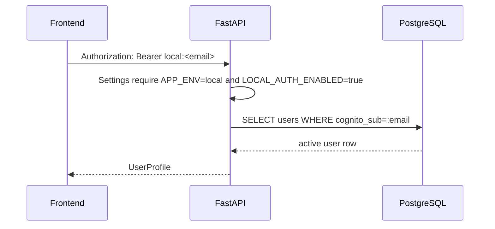
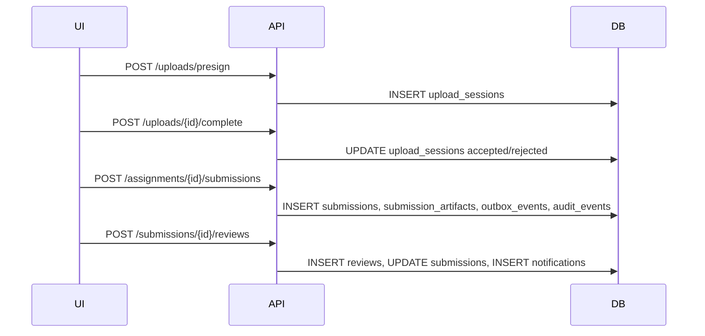
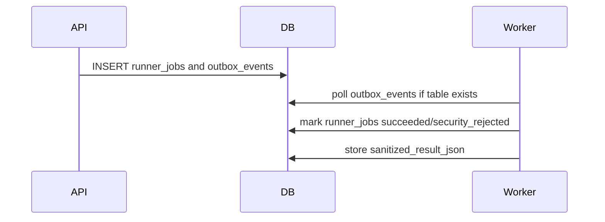
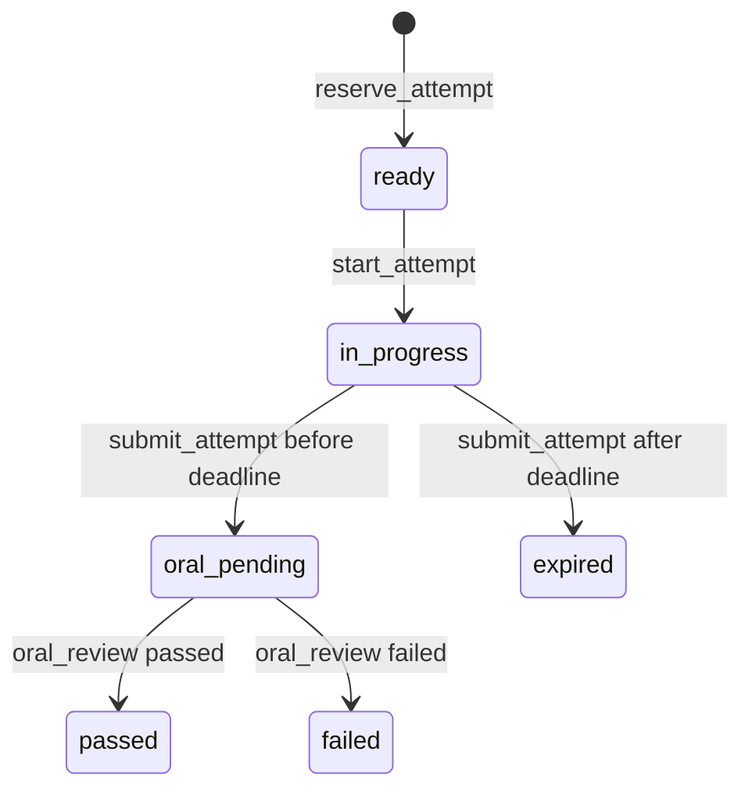

# Architecture Baseline

## System Overview

Project Taiga is a local-first learning platform MVP implemented as a modular-monolith FastAPI backend, React frontend, PostgreSQL data store, worker process, and runner-controller placeholder.

Evidence:

- `backend/src/taiga/main.py`
- `frontend/src/routes/App.tsx`
- `docker-compose.yml`
- `backend/alembic/versions/0001_initial_schema.py`
- `runner/runner_controller.py`

## Context Diagram

## Container Diagram

## Data Flows

### Authentication

Evidence: `auth.py`, `config.py`, `users` table.

### Submission and Review

Evidence: `submission_service.py`.

### Runner and Worker

UNKNOWN: Disposable isolated Docker runner is not implemented. Current behavior is disabled/local sanitized job processing.

### Exam

Evidence: `exam_service.py`, `exam_attempt_status` enum.

## Failure Behavior

- Database readiness: `/ready` calls `database_ready`.
- Worker: catches `SQLAlchemyError`, sleeps, retries.
- Missing `outbox_events`: worker checks `to_regclass` before querying.
- Runner controller: logs startup and sleeps; no runner orchestration yet.
- LocalAuth outside local: `Settings` validation raises `ValueError`.

