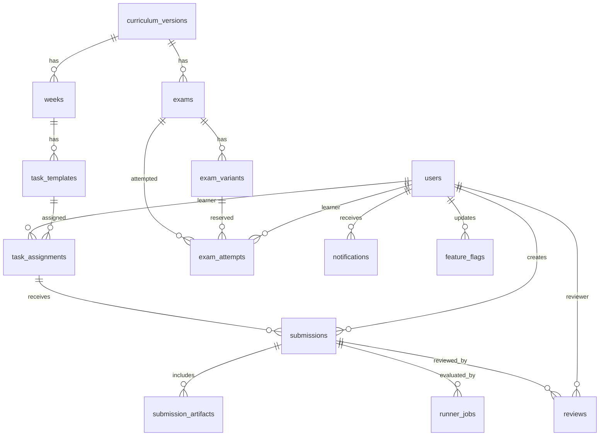

# Database Inventory

## Tables

| Table | Purpose | PK | FK | Unique | Index | Status columns | Owner module |
|---|---|---|---|---|---|---|---|
| `users` | Local/account identities | `id` | none | `cognito_sub` | role/status | `status`, `role` | auth/admin/seed |
| `curriculum_versions` | Published curriculum versions | `id` | none | `version` | none | `status` | seed/admin |
| `weeks` | Curriculum weeks | `id` | curriculum_versions | curriculum/version combos | none | none | seed |
| `task_templates` | Task definitions | `id` | curriculum_versions/weeks | curriculum/stable_code | none | none | seed/assignments |
| `task_assignments` | Learner assignments | `id` | task_templates/users | template/learner | learner/status/date | `status` | assignments/submissions |
| `upload_sessions` | Local upload lifecycle | `id` | users | object_key | owner/status | `scan_status` | submission_service |
| `submissions` | Immutable learner submissions | `id` | task_assignments/users | assignment/version | learner/created | `status` | submission_service |
| `submission_artifacts` | Submission files | `id` | submissions/uploads | s3_key | submission | none | submission_service |
| `runner_jobs` | Runner job attempts | `id` | submissions | submission/attempt | status/queued | `status` | runner_jobs/worker |
| `reviews` | Manual reviews | `id` | submissions/users | none | submission/created | `result` | submission_service |
| `exams` | Exam definitions | `id` | curriculum_versions/weeks | curriculum/stable_code | none | none | exam_service/seed |
| `exam_variants` | Snapshot variants | `id` | exams | exam/stable/version | none | `active` | exam_service/seed |
| `exam_attempts` | Learner exam attempts | `id` | exams/variants/users/submissions | exam/learner/attempt | learner/status | `status` | exam_service |
| `capability_achievements` | Capability progress | `id` | users | learner/capability/level | none | none | progress/seed |
| `rank_history` | Rank progress | `id` | users | none | learner | none | progress/exam |
| `idempotency_keys` | Idempotency storage | `id` | users | actor/route/key | none | none | NOT USED |
| `audit_events` | Audit trail | `id` | users nullable | none | entity/actor | `outcome` | submission_service |
| `outbox_events` | Transactional outbox | `id` | none | none | unpublished | `published_at` | worker/runner |
| `ai_usage_reports` | AI usage declarations | `id` | submissions | submission | none | none | NOT IMPLEMENTED API |
| `notifications` | In-app notifications | `id` | users | deduplication_key | unread | read_at | admin/submission |
| `notification_preferences` | Notification prefs | `id` | users | user/channel/event | none | enabled | admin |
| `feature_flags` | DB feature flags | `id` | users | key | none | enabled | admin/seed |
| `analytics_events` | Event analytics | `id` | none | none | name/time | none | NOT USED |
| `curriculum_import_jobs` | Curriculum import workflow | `id` | users | none | status/created | status | NOT IMPLEMENTED API |

## ER Diagram

## Constraints

- UUID primary keys.
- timezone-aware `timestamptz` timestamps.
- CHECK constraints for sizes, hashes, positive versions, deadline ordering.
- Optimistic lock columns on users, assignments, runner jobs, exam attempts, feature flags.
- Deletion behavior is mostly RESTRICT; child artifacts CASCADE from submissions; user-owned notifications cascade.
- Downgrade is intentionally prohibited in Alembic.

## Migration

- `0001_initial_schema.py` creates all schema objects.
- `downgrade()` raises RuntimeError.
- Schema drift against design DDL is not fully diffed in Phase 0; Phase 1 should run contract-level DDL diff.

## Seed

- Entrypoint: `python -m taiga.seed`.
- Canonical source: design curriculum JSON.
- Local-only realistic fixture guard: `APP_ENV=local`.
- Idempotency: stable UUIDs and `ON CONFLICT`.
- Date generation: relative to `date.today()` for demo state.
- Cleanup: `make reset` drops Compose volumes and local-storage generated files.

