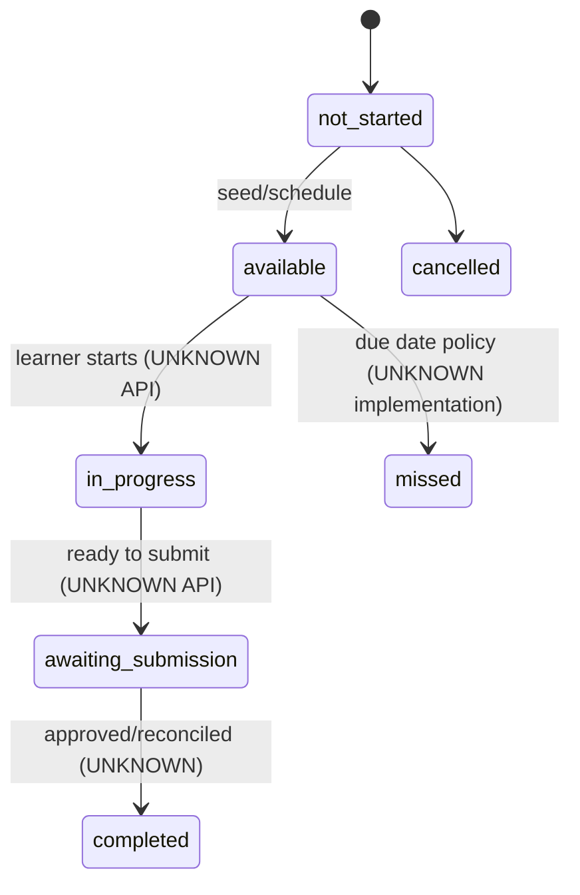
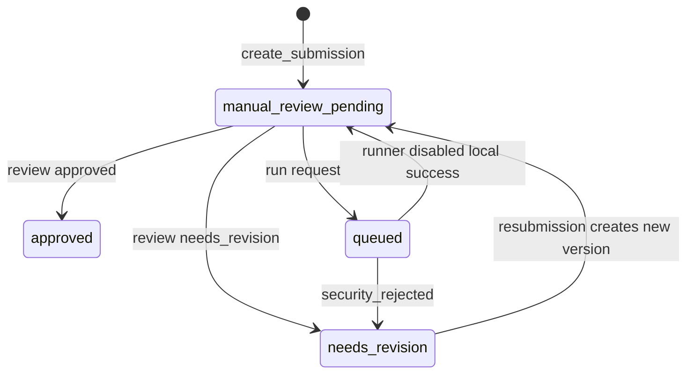
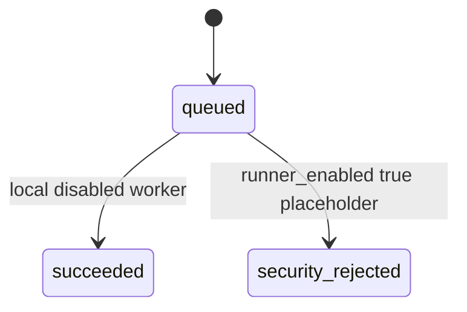
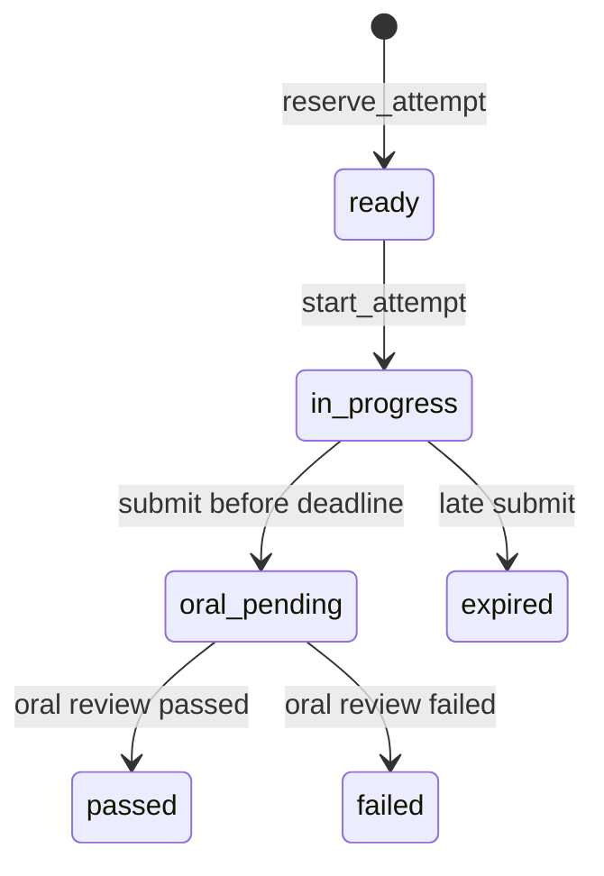
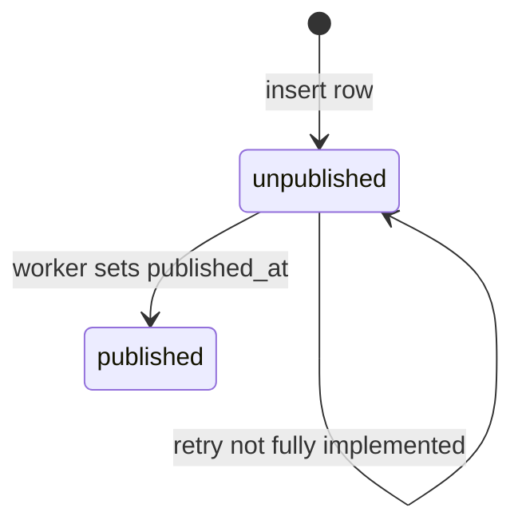

# State Machine Inventory

## Assignment

Statuses: `not_started`, `available`, `in_progress`, `awaiting_submission`, `completed`, `missed`, `cancelled`.

Evidence: DB enum and seed. Transition enforcement is mostly UNKNOWN.

## Submission

Statuses: `draft`, `submitted`, `queued`, `running`, `automated_passed`, `automated_failed`, `manual_review_pending`, `needs_revision`, `approved`, `cancelled`.

Evidence: `submission_service.py`, `runner_jobs.py`.

## Runner Job

Statuses: `queued`, `claimed`, `preflight`, `building`, `public_testing`, `hidden_testing`, `sanitizing`, `succeeded`, `failed`, `timed_out`, `cancelled`, `security_rejected`.

Most contract transitions are not implemented.

## Exam Attempt

Statuses: `scheduled`, `ready`, `in_progress`, `submitted`, `evaluating`, `oral_pending`, `passed`, `failed`, `expired`, `cancelled`.

`scheduled`, `submitted`, `evaluating`, `cancelled` are enum values but not actively transitioned by current services.

## Outbox

`outbox_events` has `published_at`, `attempt_count`, `next_attempt_at`, `last_error`.

